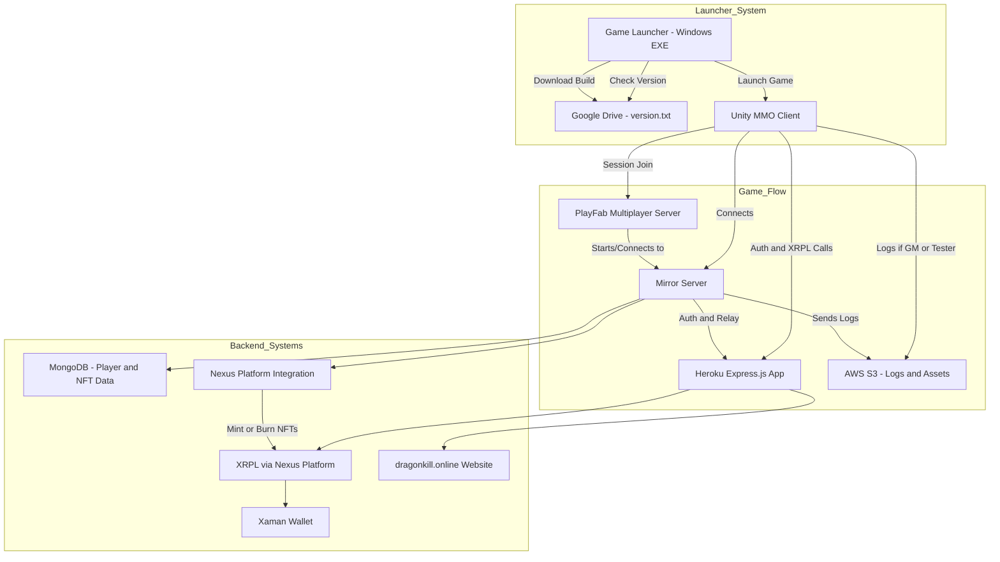

# 🐉 DragonKill MMO Metaverse

> A decentralized 2D play-to-earn MMORPG powered by Unity, Mirror Networking, and XRPL.

---

## 🧭 Overview

**DragonKill** is a server-authoritative 2D fantasy MMORPG built in Unity, powered by Mirror Networking and integrated with the XRP Ledger. With a nostalgic pixel art aesthetic and a modern blockchain-based play-to-earn economy, players earn DKP tokens, mint NFTs, own housing plots, and build their legacy across an expanding retro-inspired metaverse.

Players can exchange DKP on the XRPL decentralized exchange or convert it to in-game gold for marketplace usage, crafting, travel, and more.

---

## ✨ Features

- 🎮 **Server-Authoritative Multiplayer** – Powered by Mirror Networking to ensure fair, synchronized gameplay and prevent client-side cheating.
- 💰 **Play-to-Earn Economy** – Earn DKP tokens through gameplay, tradable on the XRP Ledger or convertible to in-game gold.
- 🏡 **NFT Housing & Guild Plots** – Own land, establish shops, and manage player-run spaces with real metaverse utility.
- 🛡️ **Class-Based Combat System** – Choose from 6 playable classes, with Druid and Paladin coming soon.
- 🌐 **Web-Integrated Player Profiles** – View your NFTs, characters, and download the launcher at [dragonkill.online](https://www.dragonkill.online).
- 🔐 **Xaman Wallet Integration** – Secure and seamless wallet support for token transactions and NFT ownership.
- 🖥️ **Cross-Platform Ambitions** – WebGL/browser version planned to make DragonKill fully accessible without installation.
---

## 🧰 Technologies Used

| Tool/Platform          | Purpose                                         |
|------------------------|-------------------------------------------------|
| **Unity 2020.3**        | Game engine and client                         |
| **Mirror Networking**   | Server-authority multiplayer                   |
| **XRPL + Xumm Wallet**  | Blockchain integration and asset management    |
| **Heroku + Express.js** | Game server controller and XRPL relay          |
| **MongoDB**             | Player data, NFT metadata, and nexus tracking  |
| **AWS S3**              | NFT assets and log storage                     |
| **GitHub**              | Source control                                 |
| **Game Launcher**       | Windows exe to install, patch, and launch game |
| **Google Drive**        | Hosts client build and version control files   |
| **Nexus Platform**      | XRPL integrations from Unity to mint/burn NFTs |
| **PlayFab**             | Manages multiplayer server hosting, player data|

---

## 🏗️ Architecture

## 🗃️ Game Launcher

DragonKill includes a custom-built launcher created in **Visual Studio**. It allows players to:

- Download the game client.
- Check for new updates by comparing a `version.txt` file on **Google Drive**.
- Automatically download the latest build if an update is found.
- Launch the game directly once up-to-date.

This ensures easy access for testers and a seamless update process without needing manual patching.

## 🔮 Future Plans

✅ Standalone Windows launcher

🔄 Migrate from Windows to Linux containers

🚧 WebGL browser version

🚧 Full NFT marketplace on dragonkill.online

🔜 Land-based sandbox marketplace across linked servers

🔜 Raiding: 12 / 24 / 48-man coordinated boss fights

🔜 DAO voting system for in-game world decisions

## 🤝 Contributing

We're building a team of passionate developers, artists, and designers. If you're interested in contributing apply @ [dragonkill.online](https://dragonkill.online/join-the-team/)

All experience levels welcome. We especially need Unity programmers, pixel artists, blockchain devs, and UI/UX designers.

## 📬 Contact
Project Maintainer: Derek Heinrichs
📧 Email: customersupport@dragonkill.online
🌐 Website: https://www.dragonkill.online

Built by a disabled U.S. veteran with the help of a passionate indie team. Join us in building a decentralized gaming future!
