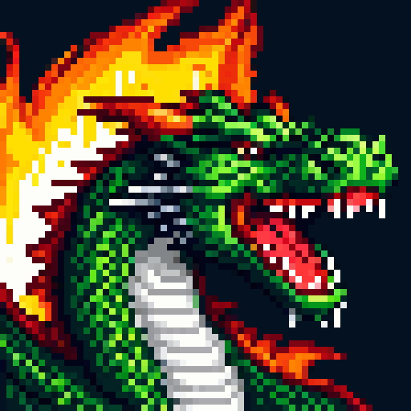
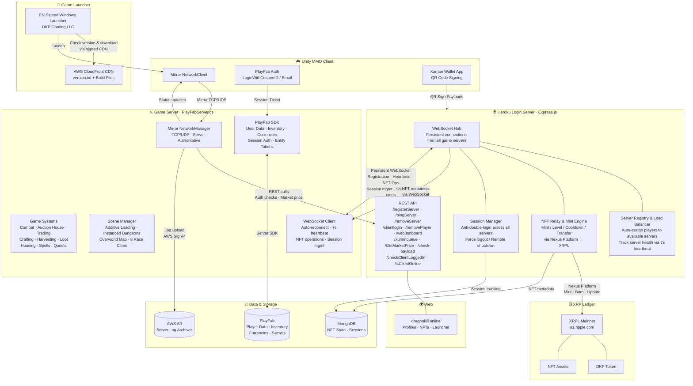

<p align="center">
  
</p>

# DragonKill MMO Metaverse

> A decentralized 2D play-to-earn MMORPG powered by Unity, Mirror Networking, and XRPL.

[](https://www.dragonkill.online)
[](License.md)

---

## 🧭 Overview

**DragonKill** is a server-authoritative 2D fantasy MMORPG built in Unity, powered by Mirror Networking and integrated with the XRP Ledger. With a nostalgic pixel art aesthetic and a modern blockchain-based play-to-earn economy, players earn DKP tokens, mint NFTs, own housing plots, and build their legacy across an expanding retro-inspired metaverse.

Players can exchange DKP on the XRPL decentralized exchange or convert it to in-game gold for marketplace usage, crafting, travel, and more.

---

## ✨ Features

- 🎮 **Server-Authoritative Multiplayer** – Powered by Mirror Networking to ensure fair, synchronized gameplay and prevent client-side cheating.
- 💰 **Play-to-Earn Economy** – Earn DKP tokens through gameplay, tradable on the XRP Ledger or convertible to in-game gold.
- 🏡 **NFT Housing & Guild Plots** – Own land, furnish interiors with NFT items, establish shops, and manage player-run spaces with real metaverse utility.
- 🛡️ **Class-Based Combat System** – Choose from 6 playable classes, with Druid and Paladin coming soon. Turn-based instanced dungeons with loot, XP, and combat points.
- 🏦 **Full Auction House** – List items, place bids, buy out, cancel sales, and collect refunds — a complete player-driven economy.
- ⚒️ **Deep Crafting System** – Six crafting disciplines: weapon crafting, armor crafting, jewel crafting, cooking, alchemy, and refining. Skill and XP progression per discipline.
- 🔄 **Player Trading** – Secure item and gold trading between players with confirmation flow.
- 🌍 **Living World** – 8 race cities, an overworld map, instanced dungeons, portals, and additive scene loading for seamless exploration.
- 🌐 **Web-Integrated Player Profiles** – View your NFTs, characters, and download the launcher at [dragonkill.online](https://www.dragonkill.online).
- 🔐 **Xaman Wallet Integration** – Secure QR-based wallet signing for token transactions, trust-sets, and NFT ownership.
- 🖥️ **Cross-Platform Ambitions** – WebGL/browser version planned to make DragonKill fully accessible without installation.

---

## 🧰 Technologies Used

| Tool / Platform              | Purpose                                                                 |
|------------------------------|-------------------------------------------------------------------------|
| **Unity 2020.3**              | Game engine and client                                                 |
| **Mirror Networking**         | Server-authoritative multiplayer (TCP/UDP)                             |
| **XRPL + Xaman Wallet**      | Blockchain integration, DKP token, NFT minting and ownership           |
| **Heroku + Express.js**       | Central login server: auth, load balancing, NFT relay, session control |
| **WebSocket (WebSocketSharp)**| Persistent game-server ↔ login-server communication                    |
| **MongoDB**                   | NFT metadata, mint operations, session tracking                        |
| **PlayFab (Azure)**           | Player data persistence, inventory, virtual currencies, server hosting |
| **Nexus Platform**            | XRPL integration layer for minting/burning NFTs from game servers      |
| **AWS S3**                    | Server log archival (AWS Signature V4)                                 |
| **AES Encryption**            | Encrypted player IDs in transit using shared secrets from PlayFab      |
| **GitHub**                    | Source control                                                         |
| **Game Launcher (Windows)**   | EV-signed launcher (DKP Gaming LLC) with version check and patching   |
| **AWS CloudFront CDN**        | Hosts client builds and version control files with signed distribution |

---

## 🏗️ Architecture

### High-Level Overview

```
┌─────────────────┐     ┌──────────────────────────────────────────────┐
│  Game Launcher   │────▶│  AWS CDN (version.txt + build files)         │
│  (EV-Signed EXE) │     │  EV Code-Signed by DKP Gaming LLC            │
│  DKP Gaming LLC  │     └──────────────────────────────────────────────┘
└────────┬────────┘
         │ Launch
         ▼
┌─────────────────┐  Mirror TCP/UDP   ┌────────────────────────────────┐
│  Unity Client    │◀────────────────▶│  Game Server (PlayFab MPS)     │
│                  │                   │  PlayFabServer.cs              │
│  • PlayFab Auth  │                   │  • Mirror NetworkManager       │
│  • Xaman Wallet  │                   │  • Combat / AH / Trading       │
│  • QR Signing    │                   │  • Crafting / Harvesting       │
└─────────────────┘                   │  • Scene Manager (8 cities)    │
                                       │  • PlayFab SDK (data/inv)      │
                                       │  • WebSocket Client            │
                                       │  • AES Encryption              │
                                       └───────────┬──────────────────┘
                                                   │
                                      WebSocket (persistent, 7s heartbeat)
                                                   │
                                       ┌───────────▼──────────────────┐
                                       │  Heroku Login Server          │
                                       │  (Express.js)                 │
                                       │                               │
                                       │  • Server Registry & LB       │
                                       │  • Auth / Anti-Double-Login   │
                                       │  • NFT Relay → Nexus → XRPL  │
                                       │  • Remote Shutdown Control    │
                                       │  • REST API + WebSocket Hub   │
                                       └──┬──────────┬───────────────┘
                                          │          │
                              ┌───────────▼┐   ┌────▼────────────────┐
                              │  MongoDB    │   │  XRPL Mainnet       │
                              │  NFT state  │   │  DKP Token + NFTs   │
                              │  Sessions   │   │  via Nexus Platform  │
                              └─────────────┘   └─────────────────────┘
```

### Detailed Architecture Diagram


```mermaid
graph TD
    subgraph CLIENT["🎮 Unity MMO Client"]
        A1[Mirror NetworkClient]
        A2[PlayFab Auth<br/>LoginWithCustomID / Email]
        A3[Xaman Wallet App<br/>QR Code Signing]
    end

    subgraph LAUNCHER["🚀 Game Launcher"]
        L1[EV-Signed Windows Launcher<br/>DKP Gaming LLC]
        L2[AWS CloudFront CDN<br/>version.txt + Build Files]
    end

    subgraph HEROKU["🌐 Heroku Login Server · Express.js"]
        direction TB
        H1["WebSocket Hub<br/>Persistent connections from all game servers"]
        H2["REST API<br/>/registerServer · /pingServer · /removeServer<br/>/clientlogin · /removePlayer · /web3onboard<br/>/xummqueue · /GetMarketPrice · /check-payload<br/>/checkClientLoggedIn · /isClientOnline"]
        H3["Server Registry & Load Balancer<br/>Auto-assign players to available servers<br/>Track server health via 7s heartbeat"]
        H4["NFT Relay & Mint Engine<br/>Mint / Level / Cooldown / Transfer<br/>via Nexus Platform → XRPL"]
        H5["Session Manager<br/>Anti-double-login across all servers<br/>Force logout / Remote shutdown"]
    end

    subgraph GAMESERVER["⚔️ Game Server · PlayFabServer.cs"]
        direction TB
        G1["Mirror NetworkManager<br/>TCP/UDP · Server-Authoritative"]
        G2["Game Systems<br/>Combat · Auction House · Trading<br/>Crafting · Harvesting · Loot<br/>Housing · Spells · Quests"]
        G3["Scene Manager<br/>Additive Loading · Instanced Dungeons<br/>Overworld Map · 8 Race Cities"]
        G4["PlayFab SDK<br/>User Data · Inventory · Currencies<br/>Session Auth · Entity Tokens"]
        G5["WebSocket Client<br/>Auto-reconnect · 7s heartbeat<br/>NFT operations · Session mgmt"]
    end

    subgraph BLOCKCHAIN["⛓️ XRP Ledger"]
        X1[XRPL Mainnet<br/>s1.ripple.com]
        X2[DKP Token]
        X3[NFT Assets]
    end

    subgraph STORAGE["💾 Data & Storage"]
        M1[(MongoDB<br/>NFT State · Sessions)]
        P1[(PlayFab<br/>Player Data · Inventory<br/>Currencies · Secrets)]
        S1[(AWS S3<br/>Server Log Archives)]
    end

    subgraph WEB["🌍 Web"]
        W1[dragonkill.online<br/>Profiles · NFTs · Launcher]
    end

    L1 -->|Check version & download<br/>via signed CDN| L2
    L1 -->|Launch| A1

    A1 -->|Mirror TCP/UDP| G1
    A2 -->|Session Ticket| G4
    A3 -.->|QR Sign Payloads| HEROKU

    G5 <-->|"Persistent WebSocket<br/>Registration · Heartbeat · NFT Ops<br/>Session mgmt · Shutdown cmds"| H1
    G1 -->|"REST calls<br/>Auth checks · Market price"| H2

    H1 --- H3
    H1 --- H4
    H1 --- H5

    H4 -->|"Nexus Platform<br/>Mint · Burn · Update"| X1
    X1 --- X2
    X1 --- X3

    G4 <-->|"Server SDK"| P1
    H4 -->|NFT metadata| M1
    H5 -->|Session tracking| M1
    G1 -->|"Log upload<br/>AWS Sig V4"| S1
    H2 --- W1

    H1 -->|"NFT responses<br/>via WebSocket"| G5
    G1 -->|"Status updates"| A1
```

---

### 🔁 Key Data Flows

#### Player Login Flow
```
Client                 Game Server              Heroku Login Server        PlayFab
  │                        │                          │                      │
  │── Mirror Connect ─────▶│                          │                      │
  │── PlayFab Session ────▶│── AuthenticateTicket ───▶│                      │── Validate ──▶
  │                        │◀─ Ticket Valid ──────────│                      │◀─ Confirmed ─│
  │                        │── /checkClientLoggedIn ─▶│                      │
  │                        │◀─ Not duplicate ─────────│                      │
  │                        │── GetUserData ──────────▶│                      │── Load Data ─▶
  │                        │◀─ Player State ──────────│                      │◀─ Full State ─│
  │◀─ Spawn in World ─────│                          │                      │
```

#### NFT Mint Flow
```
Client                 Game Server              Heroku Login Server        XRPL
  │                        │                          │                      │
  │── Request Mint ───────▶│                          │                      │
  │                        │══ WebSocket: NFTMint ═══▶│                      │
  │                        │                          │── Nexus Mint ───────▶│
  │                        │                          │◀─ Mint Confirmed ────│
  │                        │◀═ WebSocket: mintResp ═══│                      │
  │◀─ Activity Feed ──────│                          │                      │
  │                        │◀═ WebSocket: Minted ════│                      │
  │◀─ NFT Granted ────────│                          │                      │
```

#### Server Lifecycle
```
PlayFab MPS              Game Server              Heroku Login Server
  │                         │                          │
  │── Allocate Container ──▶│                          │
  │                         │── StartServer() ────────▶│
  │                         │── WebSocket Connect ────▶│
  │                         │═══ Register Server ═════▶│── Add to Registry
  │                         │                          │
  │                         │═══ Heartbeat (7s) ══════▶│── Update Health
  │                         │◀══ NAT Traversal Info ═══│
  │                         │        ...               │
  │                         │═══ endSession ══════════▶│── Remove from Registry
  │                         │── DELETE /removeServer ──▶│
  │                         │── Upload Logs ──────────▶│   (AWS S3)
  │── Terminate Container ─▶│                          │
```

---

## 🌍 Game World

| Zone                  | Type           | Description                          |
|-----------------------|----------------|--------------------------------------|
| **Town of Arudine**    | Hub Town       | Central starting town for all races  |
| **City of Aranor**     | Elf City       | Elven homeland                       |
| **City of Faylume**    | Faerie City    | Faerie realm                         |
| **City of Tinkerdeep** | Gnome City     | Gnomish workshops                    |
| **City of Titan's Fall** | Giant City   | Giant stronghold                     |
| **City of Zan'tal**    | Lizardfolk City| Reptilian settlement                 |
| **City of Gorgrond**   | Orc City       | Orcish wargrounds                    |
| **City of Mithrilheim**| Dwarf City     | Dwarven mountain halls               |
| **City of Sarthakar**  | Dragoon City   | Dragonborn citadel                   |
| **Overworld Map**      | World Map      | 2D grid-based travel between cities  |
| **Instanced Dungeons** | Combat Zones   | Dynamically loaded per match         |

---

## ⚔️ Game Systems

| System             | Description                                                                 |
|--------------------|-----------------------------------------------------------------------------|
| **Combat**          | Turn-based instanced encounters with XP, combat points, and loot drops     |
| **Auction House**   | Full bid/buyout marketplace — list, bid, buy, cancel, collect, refund      |
| **Player Trading**  | Secure item and gold exchange with confirmation steps                      |
| **Crafting**        | 6 disciplines (Weapon, Armor, Jewel, Cooking, Alchemy, Refining) with XP  |
| **Harvesting**      | Gather cloth, leather, ore, stone, and wood from world nodes               |
| **NFT Items**       | Weapons and tools gain XP up to level 100; metadata updated on-chain       |
| **Housing**         | NFT-based furniture, item deposit/withdraw, persistent player spaces       |
| **Quests**          | Quest log, progress tracking, repeatable quests with cooldowns             |
| **Spells**          | Purchasable and swappable spell loadouts per class                         |
| **Party System**    | Up to 6-player parties                                                     |
| **Arena Duels**     | 1v1 PvP challenge system                                                   |

---

## 🔮 Future Plans

- ✅ Standalone Windows launcher
- 🔄 Migrate from Windows to Linux containers
- 🚧 WebGL browser version
- 🚧 Full NFT marketplace on dragonkill.online
- 🔜 Land-based sandbox marketplace across linked servers
- 🔜 Raiding: 12 / 24 / 48-man coordinated boss fights
- 🔜 DAO voting system for in-game world decisions
- 🔜 Druid and Paladin classes

---

## 🤝 Contributing

We're building a team of passionate developers, artists, and designers. If you're interested in contributing, apply at [dragonkill.online](https://dragonkill.online/join-the-team/).

All experience levels welcome. We especially need:
- Unity C# programmers
- 2D pixel artists and animators
- Game designers
- Blockchain / XRPL developers
- UI/UX designers
- Sound designers
- Lore writers
- QA testers
- Community managers

---

## 📬 Contact

**Project Maintainer:** Derek Heinrichs  
📧 Email: customersupport@dragonkill.online  
🌐 Website: https://www.dragonkill.online

---

*Built by a disabled U.S. veteran with the help of a passionate indie team. Join us in building a decentralized gaming future!*

